## 用`.Net Core`的方式打开数据库课程设计

### `准备工作`

* Visual Studio 2019 Community
* 安装了.NET桌面开发组件


### `新建项目`

打开Visual Studio点击新建项目，选择你要创建项目的类型（控制台应用、WinForm、WPF）并给项目起个名字
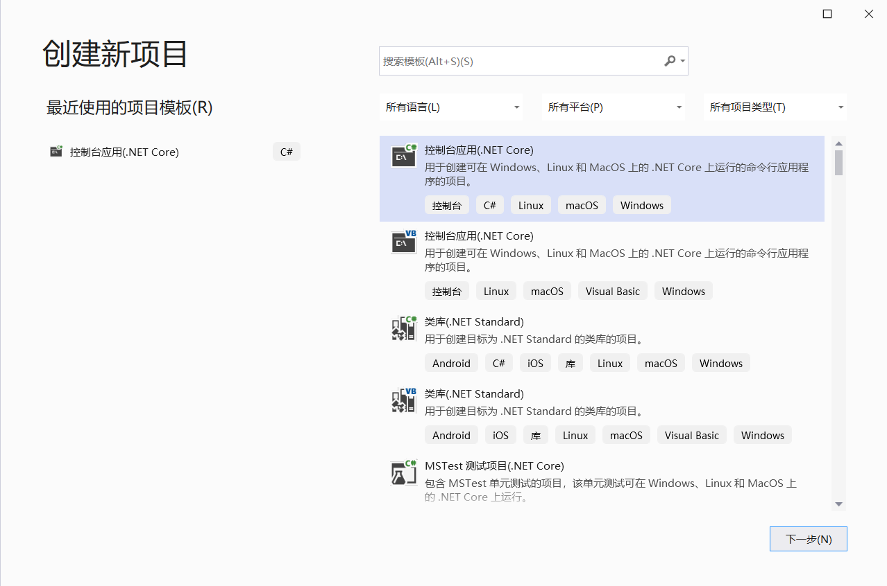
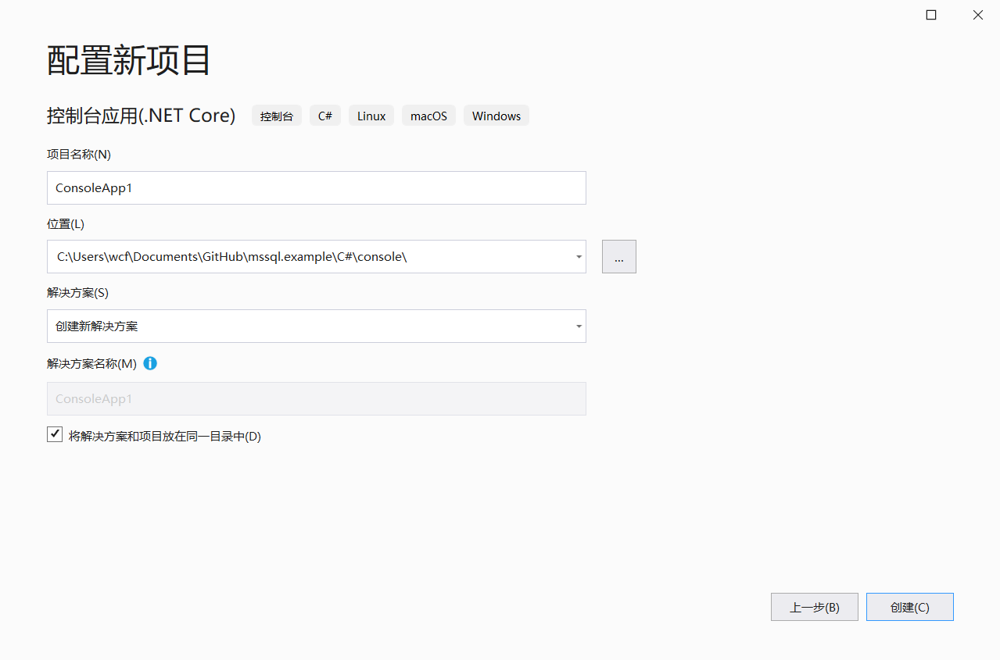

### `添加依赖`

在依赖项右键点击管理NuGet程序包，搜索'sql server'，选择System.Data.SqlClient并安装，中途跳出的提示框点击确定，许可证点击接受即可
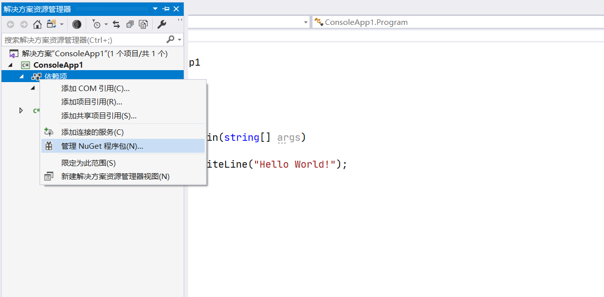

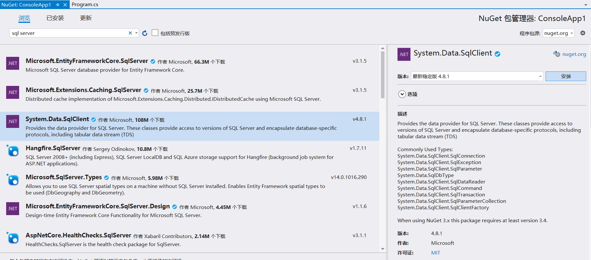
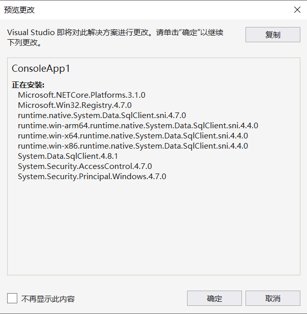
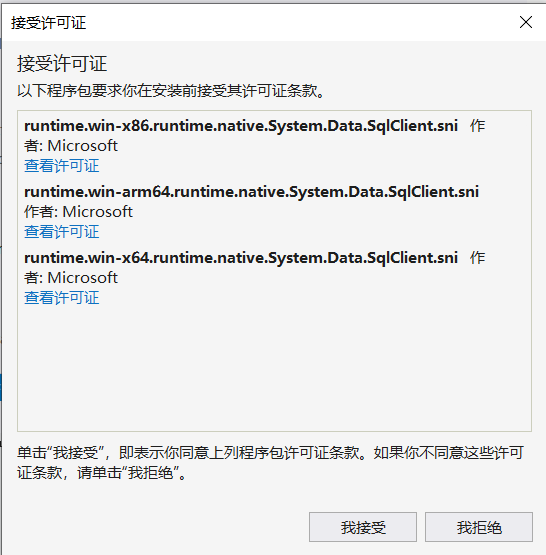

### `数据库准备`

```sql
create database db_01;

use database db_01;

create table t_01
(
    id   int identity constraint t_01_pk primary key nonclustered,
    name varchar(32) not null,
    info text
);
```

#### `初始数据`

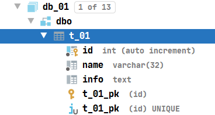
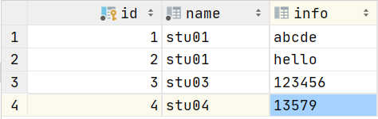

### `用代码连接数据库`

新建Connection.cs工具类用于提供SQL连接对象，可以通过Connection.GetConnection()调用，代码如下

```C#
public static SqlConnection GetConnection()
{
    try
    {
        //构建连接字符串
        SqlConnectionStringBuilder builder = new SqlConnectionStringBuilder();
        builder.DataSource = "数据库地址localhost或ip";
        builder.UserID = "sa";
        builder.Password = "你的密码";
        builder.InitialCatalog = "目标数据库";

        //根据SqlConnectionStringBuilder参数创建连接字符串
        SqlConnection connection = new SqlConnection(builder.ConnectionString);
        connection.Open();
        return connection;
    }
    catch (SqlException e)
    {
        Console.WriteLine(e.ToString());
        return null;
    }
}
```

### `查询数据`

查询id=2的记录

```C#
//查询t_01中id=2的记录
using (SqlCommand command = connection.CreateCommand())
{
    //@id为占位符，用command.Parameters.AddWithValue("@id", 2)赋值
    //即最后得到的SQL语句为'select * from t_01 where id=2'
    command.CommandText = "select * from t_01 where id=@id";
    command.Parameters.AddWithValue("@id", 2);
    //获取SqlDataReader对象来读取数据
    using (SqlDataReader reader = command.ExecuteReader())
    {
        //while循环内每次读一行，用reader["id"]读取改行id的值
        while (reader.Read())
        {
            Console.WriteLine(reader["id"]);
            Console.WriteLine(reader["name"]);
            Console.WriteLine(reader["info"]);
        }
    }
}
```

#### `查询结果`

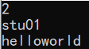

### `更新数据`

将id=2的记录的info字段修改为helloworld

```C#
using (SqlCommand command = connection.CreateCommand())
{
    //将id为2的记录的info字段改为helloworld，
    command.CommandText = "update t_01 set info=@info where id=@id";
    command.Parameters.AddWithValue("@info", "helloworld");
    command.Parameters.AddWithValue("@id", 2);
    //affectedRows保存受影响的行数
    int affectedRows = command.ExecuteNonQuery();
    Console.WriteLine(affectedRows);
}
```

#### `更新结果`

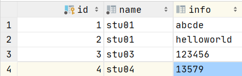

### `插入数据`

```C#
using (SqlCommand command = connection.CreateCommand())
{
    command.CommandType = CommandType.Text;
    command.CommandText = "insert into t_01 (name, info) values (@name, @info)";
    command.Parameters.AddWithValue("@name", "stu05");
    command.Parameters.AddWithValue("@info", "135790");
    int affectedRows = command.ExecuteNonQuery();
    Console.WriteLine(affectedRows);
}
```

#### `插入结果`

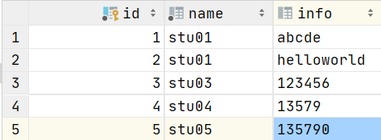

### `删除数据`

删除id=8的记录

```C#
using (SqlCommand command = connection.CreateCommand())
{
    command.CommandType = CommandType.Text;
    command.CommandText = "delete from t_01 where id=@id";
    command.Parameters.AddWithValue("@id", 8);
    int affectedRows = command.ExecuteNonQuery();
    Console.WriteLine(affectedRows);
}
```

#### `删除结果`

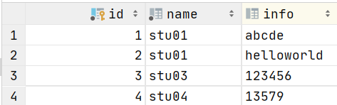
