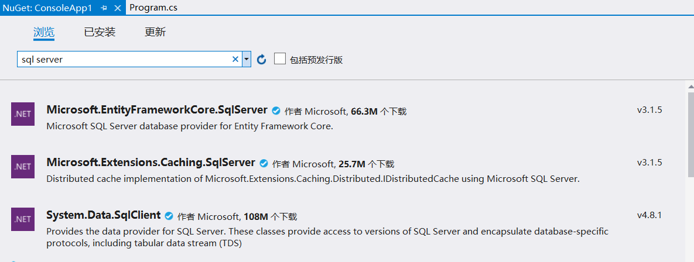

## 用.Net Core的方式打开数据库课程设计

### `准备工作`

* Visual Studio 2019 Community
* 安装了.NET桌面开发组件


### `新建项目`
打开Visual Studio点击新建项目，选择你要创建项目的类型（控制台应用、WinForm、WPF）并给项目起个名字


### `添加依赖`
在依赖项右键点击管理NuGet程序包，搜索'sql server'，选择System.Data.SqlClient并安装，中途跳出的提示框点击确定，许可证点击接受即可




### `数据库准备`
```sql
create database db_01;

use database db_01;

create table t_01
(
    id   int identity constraint t_01_pk primary key nonclustered,
    name varchar(32) not null,
    info text
);
```
#### `初始数据`


### `用代码连接数据库`
新建Connection.cs工具类用于提供SQL连接对象，可以通过Connection.GetConnection()调用，代码如下
```C#
public static SqlConnection GetConnection()
{
    try
    {
        //构建连接字符串
        SqlConnectionStringBuilder builder = new SqlConnectionStringBuilder();
        builder.DataSource = "数据库地址localhost或ip";
        builder.UserID = "sa";
        builder.Password = "你的密码";
        builder.InitialCatalog = "目标数据库";

        //根据SqlConnectionStringBuilder参数创建连接字符串
        SqlConnection connection = new SqlConnection(builder.ConnectionString);
        connection.Open();
        return connection;
    }
    catch (SqlException e)
    {
        Console.WriteLine(e.ToString());
        return null;
    }
}
```

### `查询数据`