## 用Java的方式打开数据库课程设计

### `准备工作`

* JetBrains Intellij IDEA Ultimate
* JDK 1.8或11

### `新建项目`

打开IDEA我们可以看见下面的起始页面
点击 `Create New Page` 新建项目，进入 `Java` 点击下一步，勾选`Create project from template`，点击下一步设置项目名称、路径、包名等即可创建完成
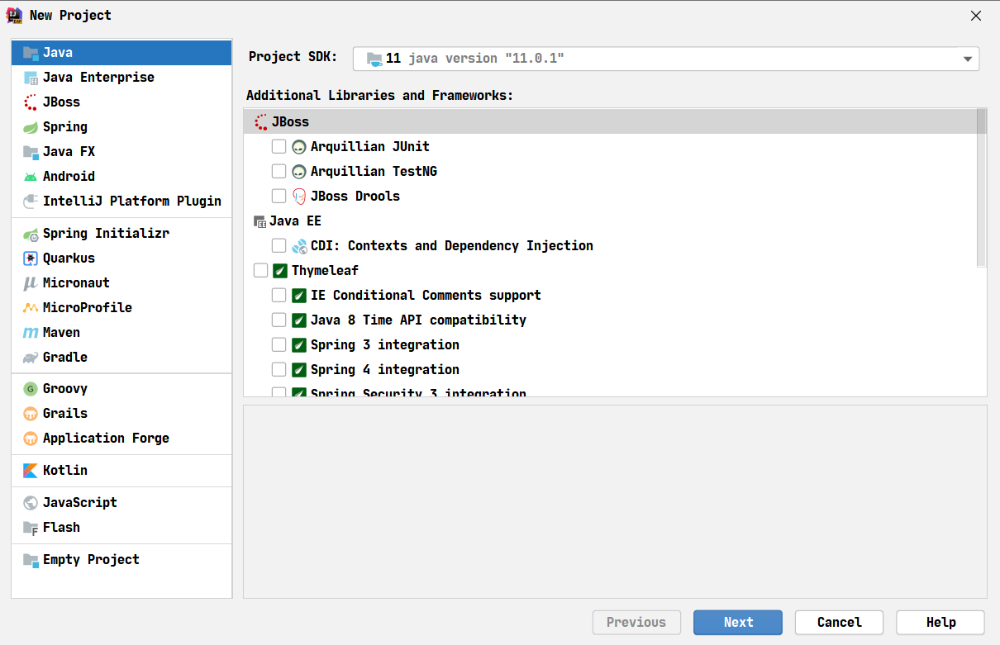
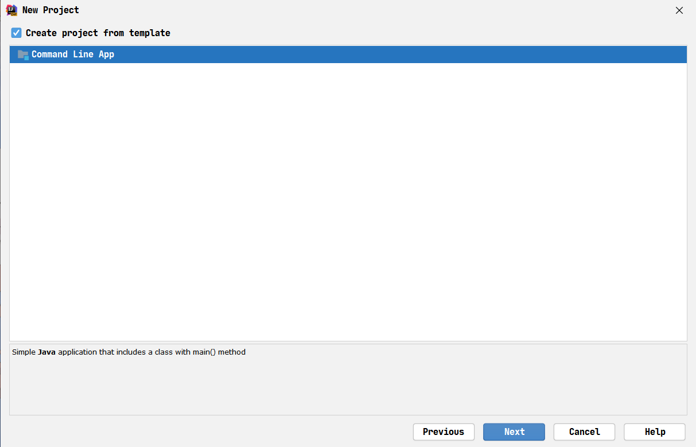
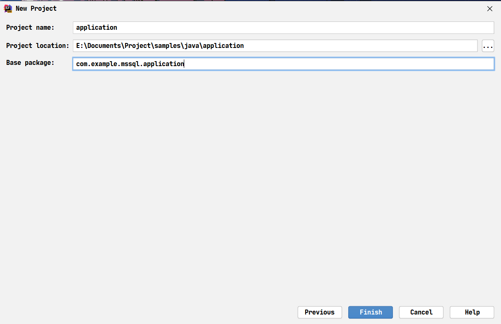
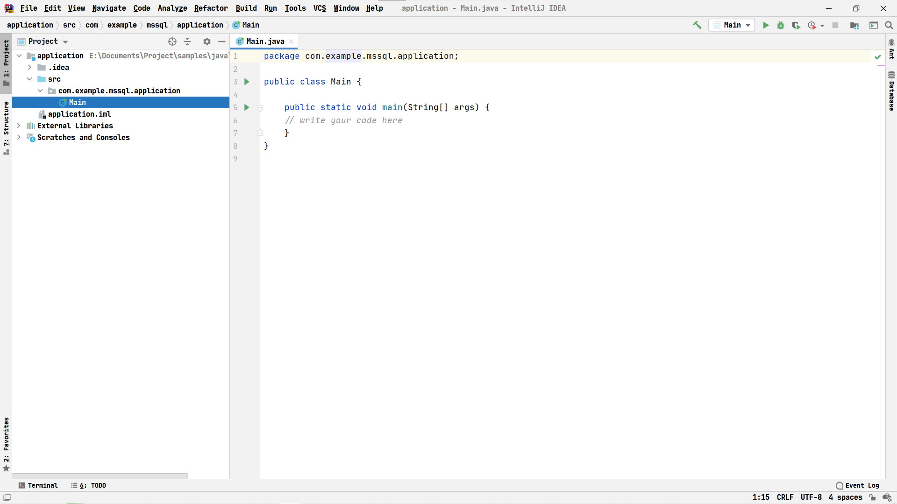

### `添加依赖`

前往[mvnrepository.com](https://mvnrepository.com/artifact/com.microsoft.sqlserver/mssql-jdbc)下载适用于mssql的jdbc驱动用以连接数据库，将连接驱动放入lib文件夹下，右键项目选择`Project Structure`，进入Libraries，点击+按钮，添加Java Lib，选择lib文件夹点击确定即可
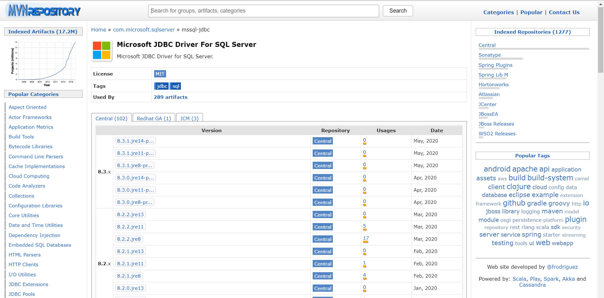
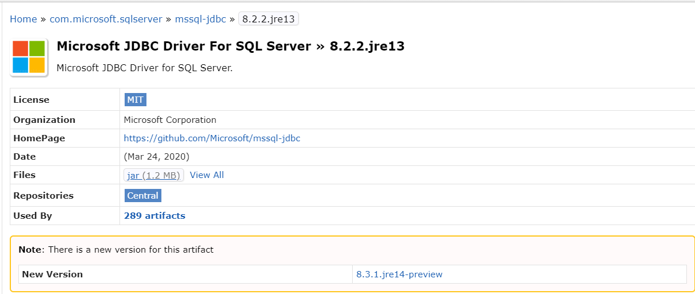
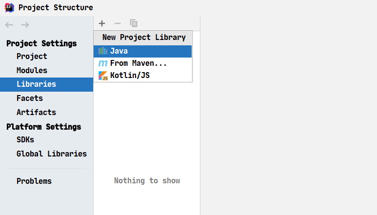
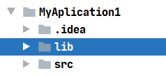

### `初始数据`

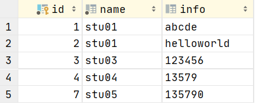

### `插入数据`

```java
//插入数据
//PreparedStatement预编译SQL语句确保安全
//?是占位符，用setString/setInt等方法插入对应占位符的值
try (PreparedStatement ps = conn.prepareStatement("insert into t_01 (name, info) values (?, ?)")) {
    ps.setString(1, "stu10");
    ps.setString(2, "135790");
    ps.execute();
} catch (SQLException e) {
    e.printStackTrace();
}
```

#### `插入结果`

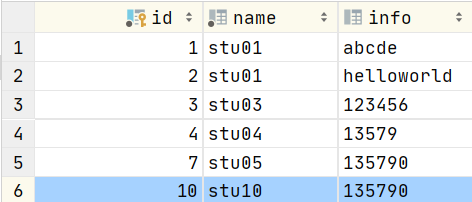

### `更新数据`

```java
//更新数据，将id=10的记录的info字段改为hello world
try (PreparedStatement ps = conn.prepareStatement("update t_01 set info=? where id=?")) {
    ps.setString(1, "hello world");
    ps.setInt(2, 10);
    ps.execute();
} catch (SQLException e) {
    e.printStackTrace();
}
```

#### `更新结果`

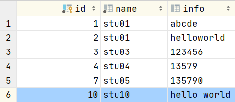

### `删除数据`

```java
//删除数据，删除id=10的记录
try (PreparedStatement ps = conn.prepareStatement("delete from t_01 where id=?")) {
    ps.setInt(1, 10);
    ps.execute();
} catch (SQLException e) {
    e.printStackTrace();
}
```

#### `删除结果`

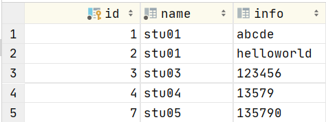

### `查询数据`

```java
//查询所有数据并输出
try (PreparedStatement ps = conn.prepareStatement("select * from t_01")) {
    try (ResultSet rs = ps.executeQuery()) {
        while (rs.next()) {
            int id = rs.getInt("id");
            String name = rs.getString("name");
            String info = rs.getString("info");
            System.out.println("id=" + id + ", name=" + name + ", info=" + info);
        }
    } catch (SQLException e) {
        e.printStackTrace();
    }
} catch (SQLException e) {
    e.printStackTrace();
}
```

#### `查询结果`

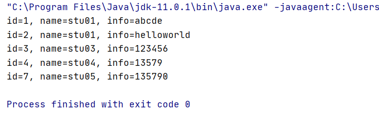
